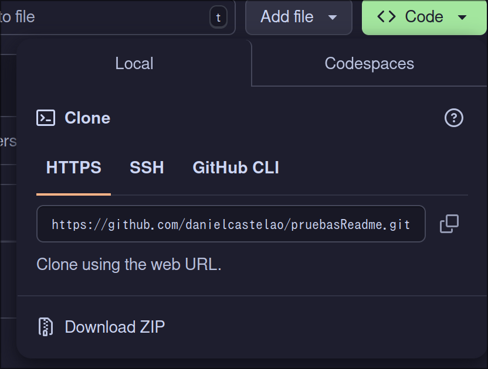

# Como cambiar un repositorio y tener los cambios en tu github

Hay dos metodos uno que seria como el más elegante y diplomatico que seria hacer un **fork**.
El otro seria clonar un repositorio para posteriormente añadirle otro repositorio tuyo como un remoto 

## Primer metodo
Este metodo consiste en pocas palabras en clonar el repositorio y añadir un remoto nuevo que corresponda a un repositorio creado por ti.

> [!IMPORTANT]
> Esa es la URL para acceder al repositorio desde el navegador para clonarlo se necesita la URL que acaba en `.git`
> Esa url puede ser obtenida tocando en github el boton **Code** que hara que se despliegue la siguiente ventana
> 

Estos son los pasos a seguir:

1. Clonamos el repositorio que en este caso es `https://github.com/danielcastelao/pruebasReadme`
2. Creamos un repositorio y copiamos la URL
3. Luego hacemos las modificaciones pertinentes en este caso indicar como se hace todo
4. Despues definimos el remoto con un nombre diferente a `origin` y que haga refiere 
5. Subimos los cambios a un repositorio remoto

Este es un esquema de los pasos a seguir

Yo lo hice en ese ordenás más o menos y asi ha sido estructurado en el diagrama pero podrias crear el remoto antes y demás

